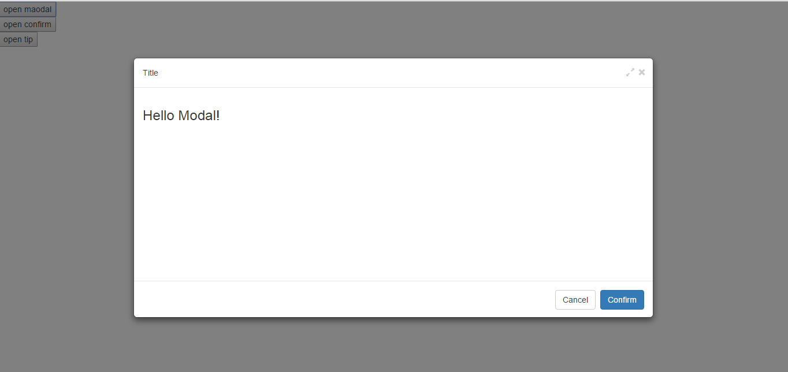
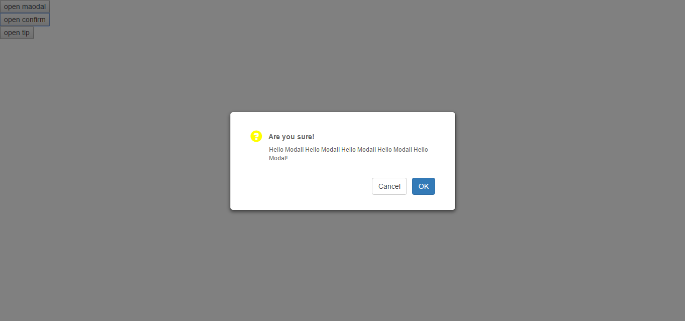
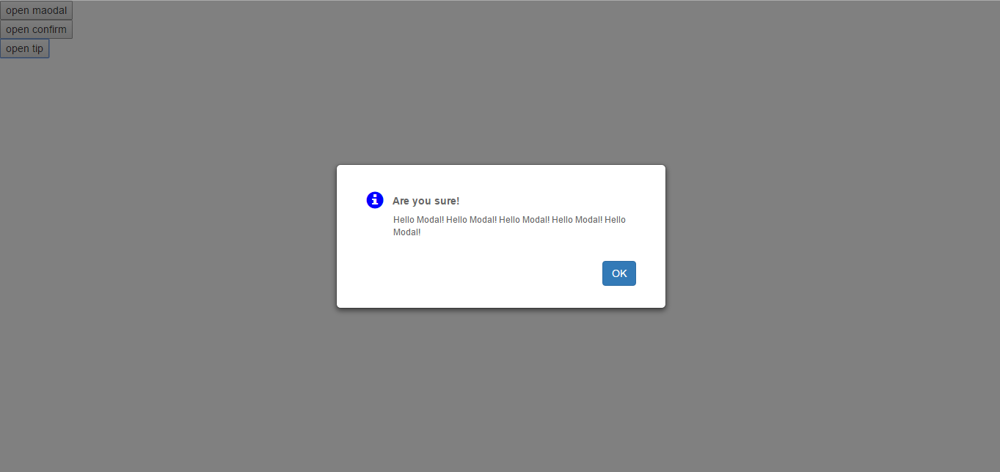

# react-bootstrap-window
React bootstrap window component, wrap around [react-window-kit](https://github.com/zhbhun/react-window-kit).

# Install
`npm install --save react-bootstrap-window`

# Usage & API
[react-window-kit](https://github.com/zhbhun/react-window-kit#api)

# Showcase
## Modal
``` javascript
class ModalDemo extends React.Component {

    constructor(props) {
        super(props);
        this.state = {
            show: false
        }
    }

    render() {
        return (
            <div>
                <button onClick={this.openWindow.bind(this)}>open modal</button>
                <Modal
                    visible={this.state.show}
                    size='lg'
                    header='Title'
                    onHide={this.closeWindow.bind(this)}
                    onCancel={this.closeWindow.bind(this)}
                    onConfirm={this.closeWindow.bind(this)}
                    >
                    <h3>Hello Modal!</h3>
                </Modal>
            </div>
        )
    }

    openWindow() {
        this.setState({
            show: true
        })
    }

    closeWindow() {
        this.setState({
            show: false
        })
    }
}
React.render(<ModalDemo/>, document.getElementById('modal-demo'));
```


## Confirm
``` javascript
class ConfirmDemo extends React.Component {

    constructor(props) {
        super(props);
        this.state = {
            show: false
        }
    }

    render() {
        return (
            <div>
                <button onClick={this.openWindow.bind(this)}>open confirm</button>
                <Confirm
                    visible={this.state.show}
                    title='Are you sure!'
                    onCancel={this.closeWindow.bind(this)}
                    onOk={this.closeWindow.bind(this)}
                    >
                    Hello Modal! Hello Modal! Hello Modal! Hello Modal! Hello Modal!
                </Confirm>
            </div>
        )
    }

    openWindow() {
        this.setState({
            show: true
        })
    }

    closeWindow() {
        this.setState({
            show: false
        })
    }
}
React.render(<ConfirmDemo/>, document.getElementById('confirm-demo'));
```



## Tip
``` javascript
class ConfirmTip extends React.Component {

    constructor(props) {
        super(props);
        this.state = {
            show: false
        }
    }

    render() {
        return (
            <div>
                <button onClick={this.openWindow.bind(this)}>open tip</button>
                <Tip
                    visible={this.state.show}
                    type='info'
                    title='Are you sure!'
                    onOk={this.closeWindow.bind(this)}
                    >
                    Hello Modal! Hello Modal! Hello Modal! Hello Modal! Hello Modal!
                </Tip>
            </div>
        )
    }

    openWindow() {
        this.setState({
            show: true
        })
    }

    closeWindow() {
        this.setState({
            show: false
        })
    }
}
React.render(<ConfirmTip/>, document.getElementById('tip-demo'));
```



# License
react-bootstrap-window is released under the MIT license.